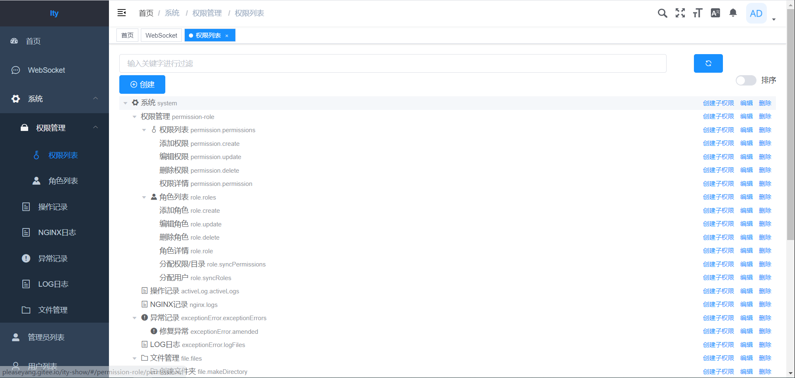
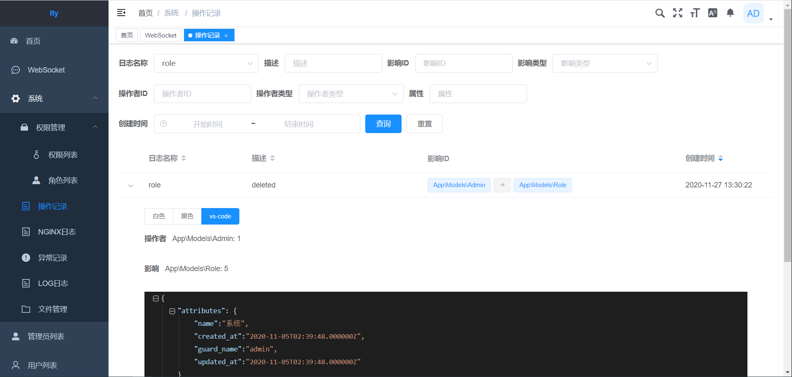
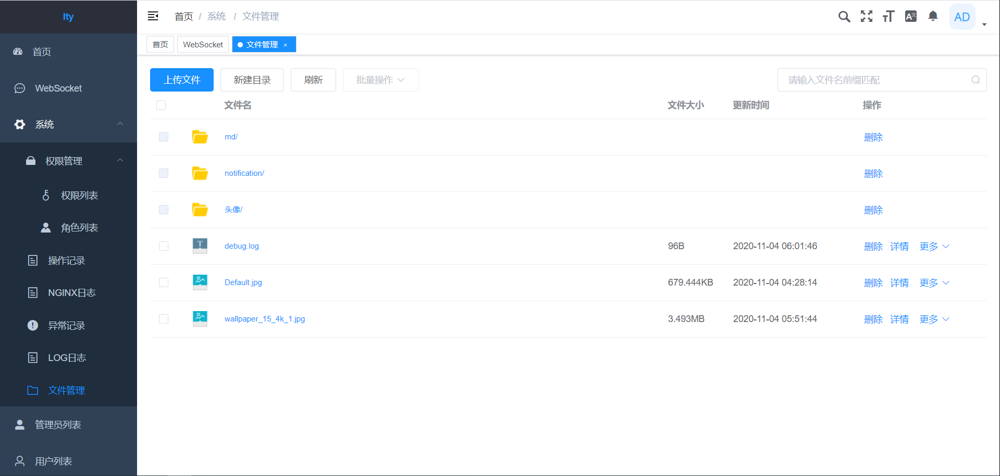
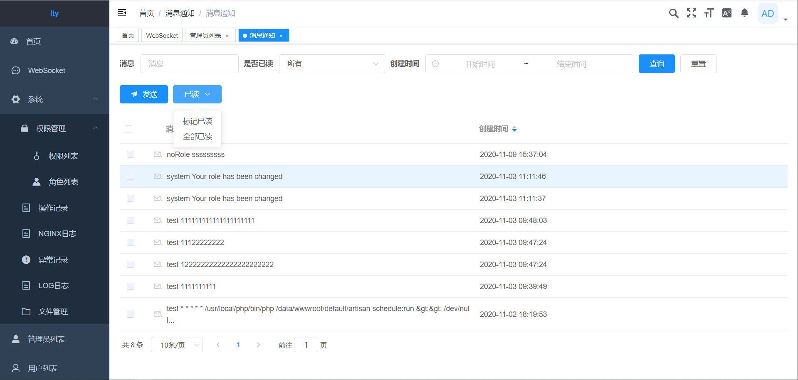
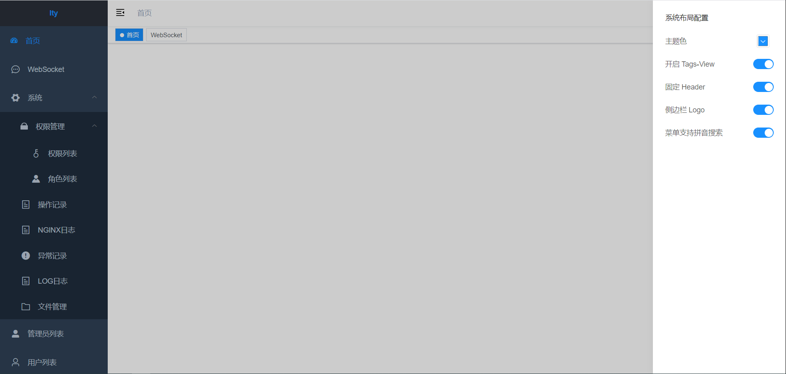
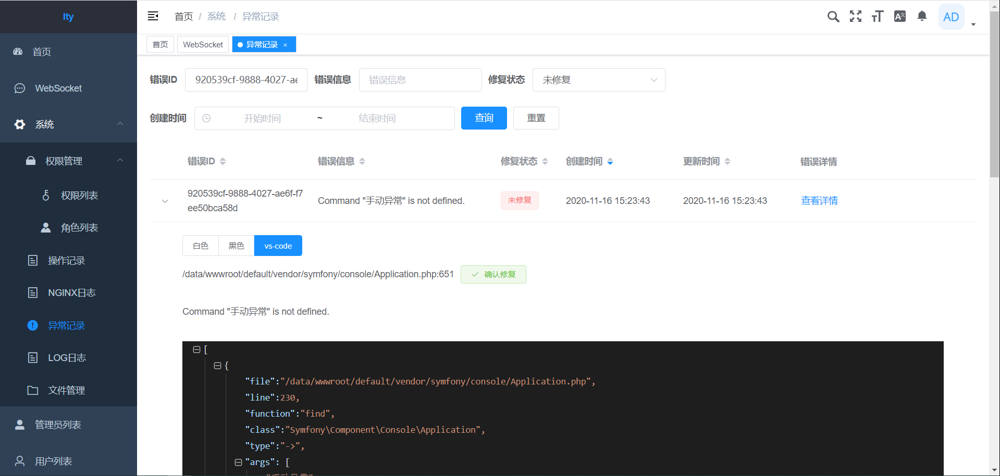

<h1 align="center">ITY</h1>
基于laravel+vue的基础后台, 前后端分离, 欢迎fork&start&pull requests

## DEMO
[http://pleaseyang.gitee.io/ity-show](http://pleaseyang.gitee.io/ity-show)

账号 look 密码 123456

## PHP
[https://gitee.com/pleaseyang/Ity](https://gitee.com/pleaseyang/Ity)

[https://github.com/pleaseyang/Ity](https://github.com/pleaseyang/Ity)

## VUE
[https://gitee.com/pleaseyang/ItyWeb](https://gitee.com/pleaseyang/ItyWeb)

[https://github.com/pleaseyang/ItyWeb](https://github.com/pleaseyang/ItyWeb)

## API文档
API文档 [https://docs.apipost.cn/view/27e22c203e0d4854](https://docs.apipost.cn/view/27e22c203e0d4854)

## 功能模块
### RBAC权限

整合 [laravel-permission](https://spatie.be/docs/laravel-permission/v3/introduction) 制作的权限角色, 管理员可绑定角色, 也可以单独设置权限

### 操作记录

整合 [laravel-activitylog](https://spatie.be/docs/laravel-activitylog/v3/introduction) 制作的操作记录, 可查看修改前后的JSON

### 文件管理

仿照 阿里云OSS 界面, 制作的文件管理页面

### 站内信

LARAVEL Notifiable Trait 搭建

### 系统布局

[vue-element-admin](https://github.com/PanJiaChen/vue-element-admin) 提供的功能, 二次修改

### 系统异常

获取异常后记录到DB中
 
## 搭建
1. `composer install`
2. `cp .env.example .env`
3. `php artisan key:generate`
4. `php artisan jwt:secret`
5. `php artisan migrate`
6. `php artisan db:seed`
7. `php artisan storage:link` (符号连接)

### Ide-Helper
1. `php artisan ide-helper:generate` (为 Facades 生成注释)
2. `php artisan ide-helper:models` (为数据模型生成注释)
3. `php artisan ide-helper:meta` (生成 PhpStorm Meta file)

### 部署
1. APP_ENV=production
2. APP_DEBUG=false
3. QUEUE_CONNECTION=redis
4. REDIS_CLIENT=phpredis (可选)
5. `composer install --optimize-autoloader --no-dev` 自动加载器改进
6. `php artisan config:cache` 优化配置加载
7. `php artisan route:cache` 优化路由加载
8. `php artisan event:cache` 优化事件加载
9. `composer dump-autoload --optimize` 优化自动加载

### 维护
1.  `php artisan down` 维护模式
    1.  `php artisan down --secret="1630542a-246b-4b66-afa1-dd72a4c43515"` 指定维护模式的绕过令牌
    2. 访问 `https://example.com/1630542a-246b-4b66-afa1-dd72a4c43515`
2. `php artisan up` 关闭维护模式
3. `php artisan activitylog:clean --days=7` 清理操作日志
4. `php artisan exceptionerror:clean --days=7` 清理异常日志

### WebSocket
1. WINDOWS: `start_for_win.bat`
2. LINUX: `php artisan workerman start --d`
3. URI: `ws://IP:2346?lang=LANG&token=TOKEN`
4. SEND: `{"route": "route.name", "data": data}`

## 备注
master :laravel最新版本的分支. 其余以laravel版本号进行命名

## 致谢
* [jetbrains](https://www.jetbrains.com) 
* [laravel](https://learnku.com/docs/laravel/8.x)
* [workerman](https://github.com/walkor/workerman)
